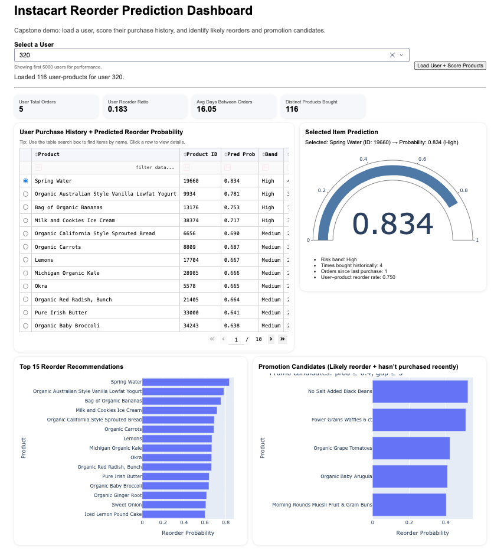

# Instacart Reorder Prediction

## Project Overview

This project develops a machine learning model to predict whether a customer will reorder a previously purchased grocery product using historical Instacart transaction data.

The project demonstrates how behavioral features derived from purchase history can be used to model customer loyalty and reorder behavior in online grocery platforms.

The final system includes:

• machine learning model for reorder prediction  
• engineered behavioral features  
• evaluation of multiple models  
• interactive Dash dashboard for predictions  

---

## Business Problem

Online grocery platforms such as Instacart need to predict which products customers are likely to purchase again.

Accurate reorder prediction enables:

• personalized product recommendations  
• "Buy Again" lists  
• targeted promotions  
• improved inventory planning  
• higher customer retention  

---

## Dataset

This project uses the **Instacart Market Basket Analysis dataset**.

Dataset source:

https://www.kaggle.com/datasets/psparks/instacart-market-basket-analysis

The raw dataset contains:

• 3+ million orders  
• 200k+ users  
• 50k+ products  

Due to the large dataset size, the raw data is **not included in this repository**.

---

## Feature Engineering

Three types of features were engineered:

### User Features

• user_total_orders  
• user_avg_days_between  
• user_reorder_ratio  
• user_total_items  
• user_distinct_products  

### Product Features

• product_popularity  
• product_reorder_rate  
• product_distinct_users  

### User–Product Interaction Features

• times_user_bought_product  
• user_product_reorder_rate  
• last_order_number_user_bought_product  
• first_order_number_user_bought_product  
• orders_since_last_purchase  

These behavioral signals capture customer purchasing patterns.

---

## Models

Two models were evaluated:

### Logistic Regression
Baseline model.

ROC-AUC ≈ 0.76

### Random Forest
Final model.

ROC-AUC ≈ 0.82

Random Forest performed better because it captures nonlinear relationships between behavioral features.

---

## Dashboard

An interactive **Dash dashboard** was built to demonstrate how the trained model could be used in a real application.

The dashboard allows users to:

• select a user  
• select a product from purchase history  
• view predicted reorder probability  
• view top reorder recommendations  
• identify promotion candidates  

Example dashboard:

---

## Running the Notebook

Open the notebook:

Instacart_Predication.ipynb

Run all cells to reproduce the full analysis.

---

## Running the Dashboard

Make sure the following files are in the same folder:

app.py
rf_reorder_model.joblib
rf_feature_columns.joblib
user_features.csv
product_features.csv
user_product_features.csv
products_lookup.csv

## Model File

The trained Random Forest model file (`rf_reorder_model.joblib` and `user_product_features.csv`) is not included in this repository because it exceeds GitHub's file size limit.

To recreate the model:

1. Run the full Jupyter notebook:
   `instacart_reorder_prediction.ipynb`

2. The notebook will train the Random Forest model and generate the required files:
   - rf_reorder_model.joblib
   - rf_feature_columns.joblib
   - user_features.csv
   - product_features.csv
   - user_product_features.csv
   - products_lookup.csv

After these files are generated, the Dash dashboard (`app.py`) can be executed.

Install dependencies:

pip install -r requirements.txt

Run the dashboard:

python(MAC python3) app.py

Then open your browser and go to:

http://127.0.0.1:8050/

---

## Key Findings

• Purchase frequency strongly predicts reorder behavior  
• Purchase recency is the most important feature  
• Random Forest outperformed Logistic Regression  
• Behavioral features capture strong customer loyalty signals  

---

## Limitations

• dataset is highly imbalanced  
• model relies only on historical purchase behavior  
• product pricing and promotions are not included  

---

## Future Work

• test gradient boosting models (XGBoost, LightGBM)  
• incorporate temporal shopping patterns  
• extend to full recommendation system  

---

## Author

Orwa Ahmad
